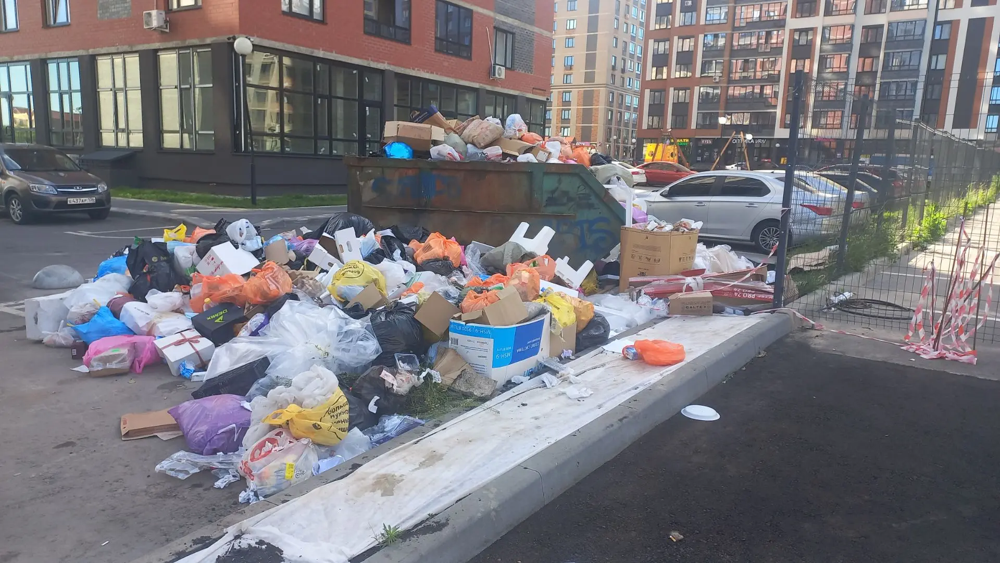
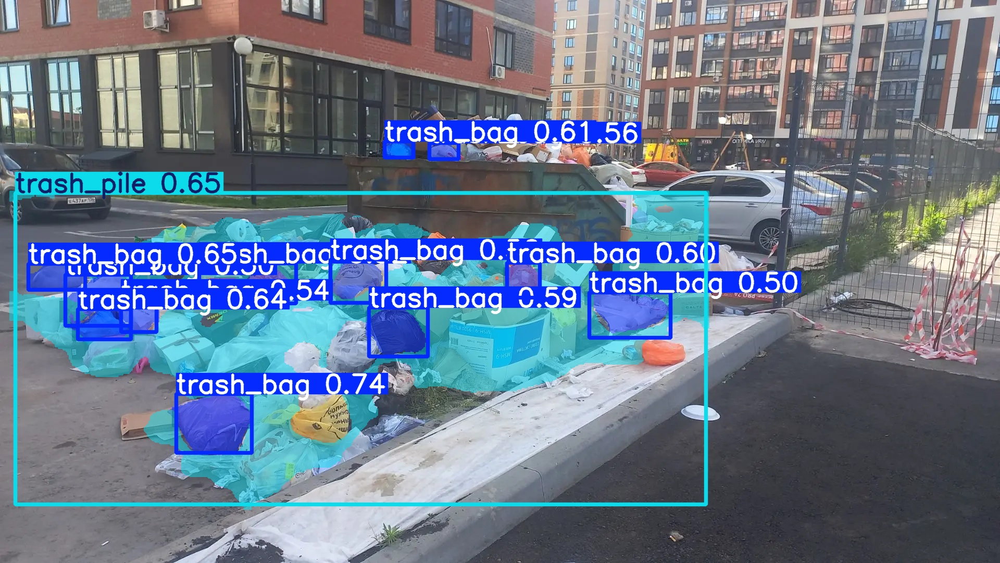
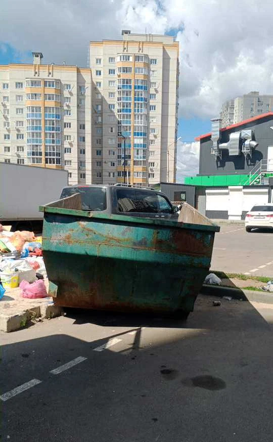
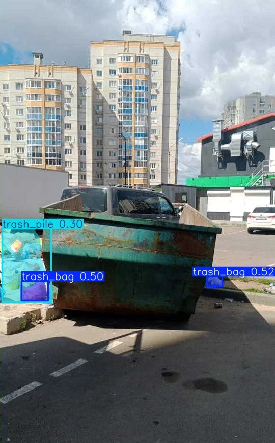
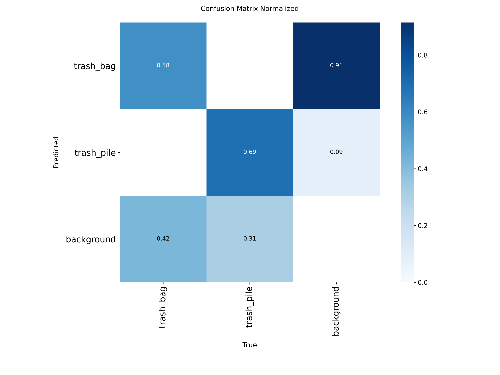

# TrashDetector 🗑️

Сегментация мусора на базе YOLO11s-seg. Модель + скрипты инференса.

🤗 **Модель на HuggingFace:** [АТ3MI/trash-detector-yolo11s](https://huggingface.co/АТ3MI/trash-detector-yolo11s)

## 📌 О проекте

**Проблема.** На контейнерных площадках мусор часто накапливается **вне контейнеров** — образуются стихийные завалы. Их сложно отслеживать вручную, особенно если площадок много.

**Решение.** Нейросеть на базе **YOLO11s-seg** сегментирует завалы на фотографиях площадок и выделяет их на изображении. Модель обучена обнаруживать два основных класса:

- 🗑 `trash_pile` — куча мусора
- 🛍 `trash_bag` — мусорный пакет / мешок

Обучение выполнено на ~200 размеченных фотографиях контейнерных площадок.

---

## 🖼 Примеры работы

### Пример 1

| До | После |
|:--:|:-----:|
|  |  |

### Пример 2

| До | После |
|:--:|:-----:|
|  |  |

---

## 📊 Метрики обучения

Модель обучена с помощью [Ultralytics YOLO11](https://docs.ultralytics.com/). Итоговые метрики на валидации:

| Метрика | Значение |
|---------|----------|
| mAP50 (Box) | **0.XX** |
| mAP50-95 (Box) | **0.XX** |
| mAP50 (Mask) | **0.XX** |
| mAP50-95 (Mask) | **0.XX** |



---

## Быстрый старт

### 1. Клонировать репозиторий

```bash
git clone https://github.com/АТ3MI/trash_det.git
cd trash_det
```

### 2. Создать виртуальное окружение

```bash
python -m venv .venv
```

Активировать:

**Windows:**
```bash
.venv\Scripts\activate
```

**Linux / macOS:**
```bash
source .venv/bin/activate
```

### 3. Установить зависимости

```bash
python -m pip install --upgrade pip
python -m pip install -r requirements.txt
```

⏱ Займёт 5–15 минут (torch и ultralytics тянут много).

### 4. Запустить сначала check_photos.py для скачивания best.pt, потом непосредственно interface_check.py для работы с GUI

```bash
python check_photos.py
python interface_check.py
```

При первом запуске модель `best.pt` (~20 МБ) автоматически скачается с HuggingFace в папку `model_weights/`.

---

## Скрипты

| Скрипт | Что делает | Модель |
|---|---|---|
| `predict.py` | Инференс на изображениях | скачивается с HF |
| `check_photos.py` | Пакетная обработка фото из `.xlsx` |
| `interface_check.py` | GUI-приложение | ищет `model_weights/best.pt` |
| `train.py` | Обучение модели | требует датасет |

### `predict.py`

```bash
python predict.py --source image.jpg
```

### `check_photos.py`

```bash
python check_photos.py
```

⚠️ Требует файл `выполнено с фото из путевого.xlsx` в корне проекта.

### `interface_check.py` (GUI)

```bash
python interface_check.py
```

⚠️ Перед запуском убедись, что `model_weights/best.pt` существует (скачается автоматически при запуске `predict.py`, или положи вручную из [HF](https://huggingface.co/АТ3MI/trash-detector-yolo11s)).

### `train.py`

```bash
python train.py
```

⚠️ Требует датасет в формате YOLO в папке `dataset/`. См. `data.yaml`.

Гиперпараметры обучения: [`docs/args.yaml`](docs/args.yaml).

---

## Структура проекта

```
trash_det/
├── predict.py            # инференс
├── check_photos.py       # пакетная обработка
├── interface_check.py    # GUI
├── train.py              # обучение
├── data.yaml             # конфиг датасета
├── TrashDetector.spec    # конфиг PyInstaller
├── requirements.txt
├── docs/                 # метрики, графики, args.yaml
├── model_weights/        # создаётся автоматически, best.pt
├── dataset/              # для обучения
└── runs/                 # результаты обучения
```

---

## Сборка .exe

```bash
python -m pip install pyinstaller
pyinstaller TrashDetector.spec
```

Результат — в `dist/`. Модель `best.pt` должна лежать рядом с exe в `model_weights/`.

---

## Contributing

Хочешь внести вклад? Отлично!

1. Сделай **fork** репозитория
2. Создай ветку для своей фичи:
   ```bash
   git checkout -b feature/my-feature
   ```
3. Внеси изменения, закоммить:
   ```bash
   git commit -m "Add my feature"
   ```
4. Запушь в свой форк:
   ```bash
   git push origin feature/my-feature
   ```
5. Открой **Pull Request** в `АТ3MI/trash_det:main`

⚠️ Ветка `main` защищена — прямые пуши запрещены. Все изменения только через PR.

---

## Лицензия

MIT
